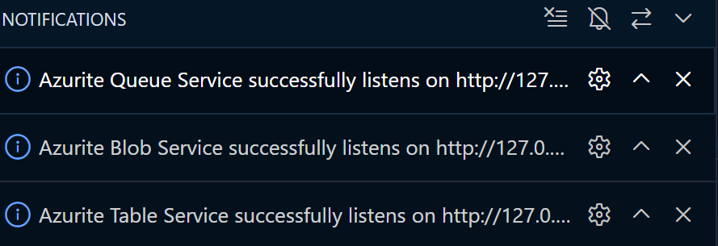
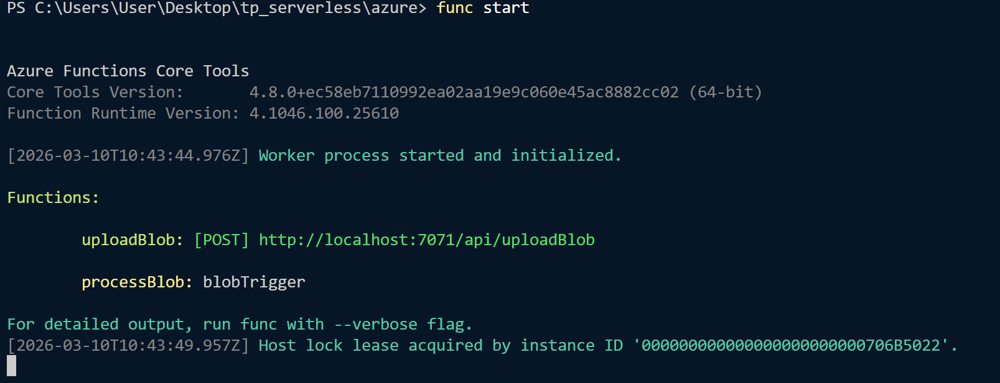
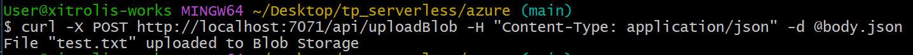
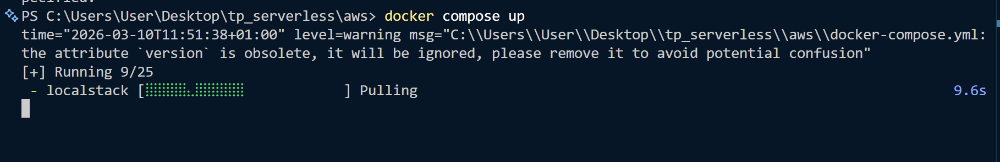
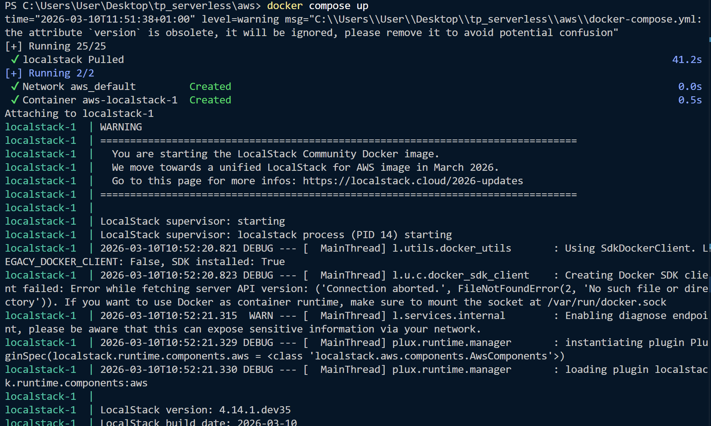
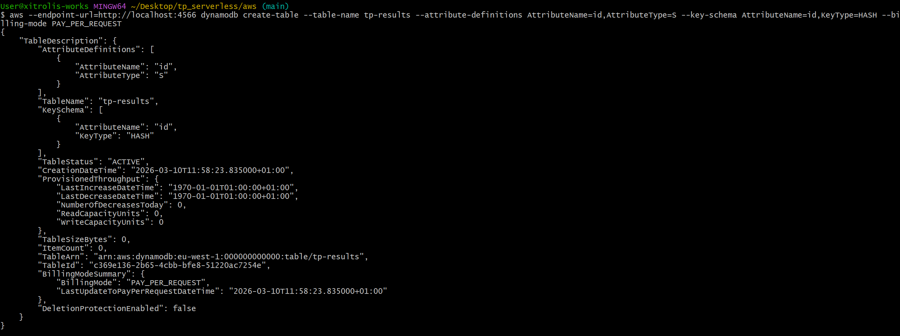
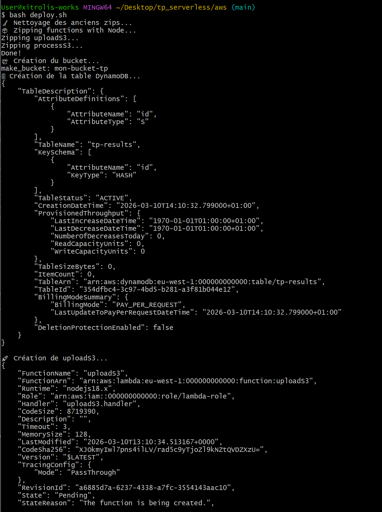
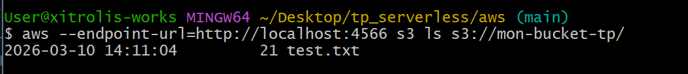
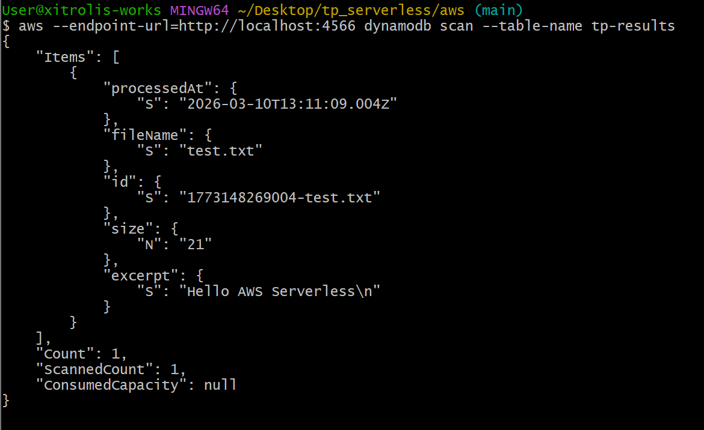
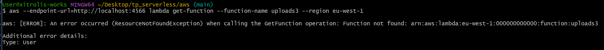

# ⚡ TP 1 - Serverless & Object Storage : Azure Functions vs AWS Lambda 


## Architecture générale

Ce TP implémente une architecture événementielle identique sur deux plateformes cloud :
- **Azure** : Azure Functions + Blob Storage + Table Storage (émulés via Azurite)
- **AWS** : AWS Lambda + S3 + DynamoDB (émulés via LocalStack)

---

## 1. Partie Azure

### Architecture
```
HTTP POST /api/uploadBlob
        │
        ▼
┌─────────────────┐
│   uploadBlob    │  ← Azure Function (HTTP Trigger)
│                 │  reçoit {name, content}
└────────┬────────┘
         │ écrit le fichier
         ▼
┌─────────────────┐
│  Blob Storage   │  ← Azurite (container "uploads")
│  (Azurite)      │
└────────┬────────┘
         │ déclenche automatiquement
         ▼
┌─────────────────┐
│  processBlob    │  ← Azure Function (Blob Trigger)
│                 │  lit le blob, écrit dans Table Storage
└────────┬────────┘
         │ écrit l'enregistrement
         ▼
┌─────────────────┐
│  Table Storage  │  ← Azurite (table "results")
│  (Azurite)      │  fileName, processedAt, size, excerpt
└─────────────────┘
```

### Rôle de chaque fonction

#### `uploadBlob` (HTTP Trigger)
- **Fichier** : `azure/src/functions/uploadBlob.js`
- **Déclenchement** : requête HTTP POST sur `/api/uploadBlob`
- **Entrée** : JSON `{ "name": "fichier.txt", "content": "contenu" }`
- **Rôle** : dépose le fichier dans le container `uploads` du Blob Storage Azurite
- **Sortie** : réponse HTTP 200 avec confirmation

#### `processBlob` (Blob Trigger)
- **Fichier** : `azure/src/functions/processBlob.js`
- **Déclenchement** : automatique à chaque ajout de blob dans le container `uploads`
- **Rôle** : lit le contenu du blob et écrit un enregistrement dans Table Storage
- **Données écrites** : `fileName`, `processedAt`, `size`, `excerpt` (100 premiers caractères)

### Prérequis

- Node.js 18+
- Azure Functions Core Tools v4 : `npm install -g azure-functions-core-tools@4`
- Extension VS Code **Azurite**

### Pour lancer la partie Azure en local

**1. Démarrer Azurite**
Dans VS Code : `Ctrl+Shift+P` → `Azurite: Start`



**2. Installer les dépendances**
```bash
cd azure
npm install
```

**3. Lancer les fonctions**
```bash
func start
```



**4. Tester**

Créer un fichier `body.json` :
```json
{ "name": "test.txt", "content": "Hello Azure Serverless" }
```

Envoyer la requête :
```bash
curl -X POST http://localhost:7071/api/uploadBlob \
  -H "Content-Type: application/json" \
  -d @body.json
```


---

## 2. Partie AWS

### Architecture
```
Event JSON (CLI)
        │
        ▼
┌─────────────────┐
│   uploadS3      │  ← AWS Lambda (invocation directe CLI)
│                 │  reçoit {name, content}
└────────┬────────┘
         │ écrit le fichier
         ▼
┌─────────────────┐
│   Bucket S3     │  ← LocalStack (bucket "mon-bucket-tp")
└────────┬────────┘
         │ déclenche automatiquement (S3 Event Notification)
         ▼
┌─────────────────┐
│   processS3     │  ← AWS Lambda (S3 Trigger)
│                 │  lit l'objet S3, écrit dans DynamoDB
└────────┬────────┘
         │ écrit l'enregistrement
         ▼
┌─────────────────┐
│    DynamoDB     │  ← LocalStack (table "tp-results")
│                 │  id, fileName, processedAt, size, excerpt
└─────────────────┘
```

### Prérequis

- Docker Desktop
- AWS CLI v2
- Node.js 18+

### Lancer la partie AWS en local

**1. Démarrer LocalStack**
```bash
cd aws
docker compose up
```



**2. Créer les ressources AWS (première fois uniquement)**
```bash
aws --endpoint-url=http://localhost:4566 s3 mb s3://mon-bucket-tp

aws --endpoint-url=http://localhost:4566 dynamodb create-table \
  --table-name tp-results \
  --attribute-definitions AttributeName=id,AttributeType=S \
  --key-schema AttributeName=id,KeyType=HASH \
  --billing-mode PAY_PER_REQUEST
```



### Déploiement des fonctions Lambda

Les fonctions Lambda sont empaquetées via un script Node (`zip.js`) puis déployées automatiquement via `deploy.sh`.

#### Packaging des fonctions

Le script `zip.js` génère deux archives :

- `uploadS3.zip`
- `processS3.zip`

Chaque archive contient :

- le fichier de la fonction
- les dépendances `node_modules`

Exécution :

```bash
node zip.js
```

#### Déploiement

Le script `deploy.sh` :

- zip les fonctions
- crée les Lambdas
- configure la permission S3 → Lambda
- configure la notification S3

```
bash deploy.sh
```


#### Test du pipeline serverless AWS

#### 1/ Upload d’un fichier dans S3

```bash
echo "Hello AWS Serverless" > test.txt

aws --endpoint-url=http://localhost:4566 s3 cp test.txt s3://mon-bucket-tp/test.txt
```


#### 2/ Vérifier que le fichier est dans le bucket

```
aws --endpoint-url=http://localhost:4566 s3ls s3://mon-bucket-tp/
```

Résultat attendu :




#### 3/ Vérifier que la Lambda de traitement s’est déclenchée

La Lambda `processs3` est déclenchée automatiquement par l’événement S3.

Elle lit le fichier et écrit un enregistrement dans DynamoDB.

```
aws --endpoint-url=http://localhost:4566 dynamodb scan--table-name tp-results
```

Exemple de résultat :




### Fonctionnement final du pipeline AWS

```
Upload fichier
      │
      ▼
┌───────────────┐
│   S3 Bucket   │
│ mon-bucket-tp │
└───────┬───────┘
        │
        │ S3 Event Notification
        ▼
┌─────────────────┐
│   processS3     │
│  AWS Lambda     │
└────────┬────────┘
         │
         ▼
┌─────────────────┐
│    DynamoDB     │
│    tp-results   │
└─────────────────┘
```


### Limitation rencontrée avec LocalStack

Lors des tests, un comportement incohérent a été observé avec LocalStack :

- `lambda list-functions` affiche correctement les fonctions
- mais `lambda get-function` et `lambda invoke` retournent parfois `ResourceNotFoundException`


Malgré cela :

- la notification **S3 → Lambda fonctionne correctement**
- la Lambda `processs3` est bien déclenchée
- les données sont correctement écrites dans **DynamoDB**

Le pipeline serverless principal reste donc **fonctionnel en local**.

### Conclusion AWS

L’architecture AWS locale permet de reproduire une architecture serverless complète :

- stockage d’objet avec **S3**
- déclenchement automatique via **S3 Event Notification**
- traitement via **AWS Lambda**
- stockage structuré via **DynamoDB**

LocalStack permet de tester ces interactions **sans compte AWS réel**.

---

## 3. Analyse comparative Azure vs AWS

Ce TP permet de comparer deux approches du serverless à travers Azure Functions et AWS Lambda.

### Modèle de déclenchement

Sur **Azure**, les triggers sont configurés de manière déclarative directement dans les fonctions via les bindings. Par exemple, le Blob Trigger permet de déclencher automatiquement une fonction lorsqu’un fichier est ajouté dans un container.

Sur **AWS**, le déclenchement repose sur la configuration explicite des événements. Dans notre cas, une **S3 Event Notification** déclenche la Lambda `processS3` lorsqu’un objet est créé dans le bucket.

Ainsi, Azure propose un modèle plus intégré avec ses bindings, tandis qu’AWS utilise une approche plus explicite basée sur la configuration des services.

### Developer Experience

La mise en place avec **Azure Functions** est relativement simple grâce aux outils intégrés comme Azure Functions Core Tools et Azurite. Les triggers et les connexions aux services sont facilement configurables via les bindings.

Du côté **AWS**, la configuration demande davantage d’étapes : création des fonctions Lambda, configuration des permissions, mise en place des notifications S3 et gestion de DynamoDB. L’émulation avec LocalStack permet néanmoins de reproduire l’environnement AWS localement.

### Configuration et complexité

Azure simplifie la configuration grâce aux **bindings déclaratifs**, qui réduisent la quantité de code nécessaire pour interagir avec les services.

AWS nécessite une configuration plus détaillée, notamment pour :
- les permissions IAM
- les déclencheurs d’événements
- la configuration des ressources.

Cependant, cette approche offre plus de contrôle sur l’architecture.

### Émulation locale

Les deux plateformes proposent des outils d’émulation locale :

- **Azurite** pour Azure Storage
- **LocalStack** pour les services AWS

Azurite est relativement simple à configurer et fonctionne de manière stable avec Azure Functions. LocalStack permet de simuler plusieurs services AWS mais peut présenter certaines limitations ou comportements incohérents lors de l’exécution des fonctions Lambda.

### Portabilité

Dans les deux cas, le code métier reste relativement portable. Cependant, les fonctions restent dépendantes des services spécifiques du cloud provider (Blob Storage / Table Storage pour Azure, S3 / DynamoDB pour AWS).

Un changement de plateforme nécessiterait donc d’adapter l’intégration avec les services de stockage et les mécanismes de déclenchement.

---

## Conclusion générale

Ce TP permet de comparer deux approches du serverless :

- **Azure Functions** utilise un modèle fortement déclaratif avec des *bindings* simplifiant l’accès aux services (Blob Storage, Table Storage).
- **AWS Lambda** nécessite une configuration plus explicite (permissions, triggers S3, configuration DynamoDB).

L’émulation locale avec **Azurite** et **LocalStack** permet de tester ces architectures sans utiliser de ressources cloud réelles.

Malgré certaines limitations de l’émulation Lambda dans LocalStack, les deux architectures ont pu être exécutées localement et démontrent le fonctionnement d’une architecture **événementielle serverless complète**.